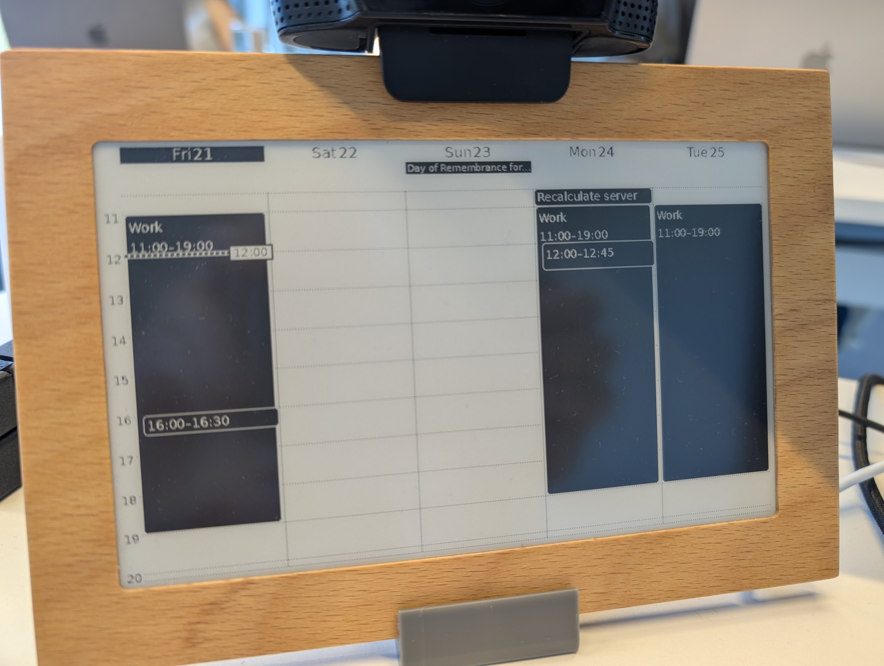

# invisible-computers-5days

A **800×480, 1-bit** Google-Calendar renderer for an [Invisible Computers](https://invisible-computers.com/)
e-ink screen. It renders a 5-day view (black cards, white text, checkerboard for
past events, dotted hour/day lines, current-time line) and publishes it as a
single PNG the screen fetches over the internet.

<p align="center">
  
</p>

> **Full code reference:** this project reuses the calendar/OAuth/render engine
> from the original 1872×1404 e-ink calendar —
> **https://github.com/sneakyjoeru/eink-calendar-1872x1404**. `app/render.py`,
> `app/calendar_client.py`, and `app/settings_store.py` are adapted from there;
> see that repo for the complete driver + hardware documentation.

## Architecture

```
Orange Pi Zero 2W (always-on, home)                 Public web host (Apache)
  app/mac_main.py (OPEN_MODE, HTTPS)                   <web-root>/YOUR_PATH/
   • Google OAuth (company/personal account)                     image.png   ◄─┐
   • renders 5-day 800×480 1-bit PNG every 30 min                              │
     and on any event add/remove/modify                                        │
   • low-priority systemd service (Nice=15)                                    │  scp every 2 min
        │ config/render.png                                                    │  (deploy/eink-push.timer
        └───────────────────────────────────────────────────────────────────►┘   → push_to_website.sh)

  Invisible Computers screen ──HTTP GET──► https://YOUR_HOST/YOUR_PATH/calendar.png
```

The screen (or its cloud) fetches a **public** URL, so the image is published to
an Apache host rather than served from a private LAN address.

- **Supersampled render:** the shared layout is composed at 3× (2400×1440) then
  downscaled + thresholded to a true 1-bit 800×480 PNG (`app/mac_driver.py`), so
  1-bit details stay crisp. Fine features are drawn thick enough to survive the
  downscale.
- **`OPEN_MODE`** (env): serves openly on a trusted network with no auth — used
  on the Pi. Without it the app is en0-bound + token-gated (the original
  work-laptop mode; see `app/netguard.py`).

## Layout / rendering

- 5-day view fills the full height; day labels (Thu 6 …) at the top, all-day
  events as bars directly below the labels, then the hour grid.
- Black event cards, 1px rounded white borders; **white separators** for
  overlapping (cascaded) events; **checkerboard** fill for past events with
  outlined text; dotted hour lines (`100100`) and day lines (`1010`);
  current-time line + white-bordered time pill.

## Run (Orange Pi)

```bash
sudo mkdir -p /opt/eink-calendar-work && sudo chown "$USER" /opt/eink-calendar-work
rsync -a app assets requirements.txt "$USER@<pi>:/opt/eink-calendar-work/"
cd /opt/eink-calendar-work && python3 -m venv .venv && ./.venv/bin/pip install -r requirements.txt
sudo cp deploy/eink-calendar-work.service /etc/systemd/system/
sudo systemctl enable --now eink-calendar-work
```

Then open `https://<pi>:8890/` to upload `client_secret.json`, sign in with
Google, and pick calendars.

### Publish to a public host

```bash
cp deploy/push.env.example config/push.env   # set WEBSITE_HOST + WEBSITE_DEST
sudo cp deploy/eink-push.service deploy/eink-push.timer /etc/systemd/system/
sudo systemctl enable --now eink-push.timer   # scp the image every 2 min
```
Add a `RewriteEngine Off` `.htaccess` if your host rewrites static paths (the
push script does this automatically).

## Config (env — `app/config.py`)

`OUTPUT_W/H` (800×480), `SUPERSAMPLE` (3), `APP_PORT` (8890), `OPEN_MODE`,
`SSL_ENABLED`, `EINK_CONFIG_DIR`, `EINK_RENDER_IMAGE`, `RENDER_INTERVAL_SEC`
(1800), `EVENT_POLL_SEC` (60).

## Secrets

Everything sensitive lives under `config/` (gitignored): Google
`client_secret.json`/`token.json`, `access_token`, SSH `pi_key`, `push.env`,
SSL keys, logs. Nothing secret is committed.

## License

MIT — same as the upstream project.
